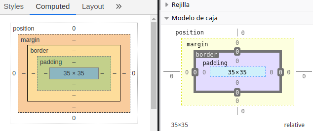
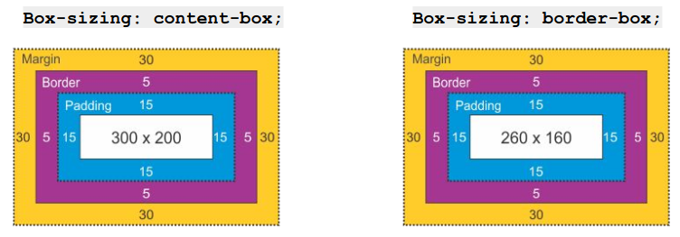

# CSS
Son estilos en cascada porque los estilos se aplican de arriba a abajo y, en caso de existir ambigüedad, siguen una serie de normas para resolverla.

Gracias a CSS podemos llevar a cabo el concepto de separación de presentación (diseño, colores, formas - CSS) y contenido (información y datos - HTML).

## Espaciado CSS
Así se ve el **modelo caja** en el inspector de cada navegador (derecha: Chrome, izquierda: Firefox):


- Padding: entre elemento y elementos internos
- Margin: entre elemento y elementos externos

Ejemplo:
```css
.warning {
	padding-top: 100px; /* este no aplica,
						   porque el siguiente lo sobreescribe */
	padding: 50px;
}
```

Los márgenes entre elementos del mismo nivel no se suman, sino que se queda el mayor.
Con los paddings sí se suman (son una propiedad interna de la caja).

> Recomendación: usar por lo general padding-bottom. Sobre todo mantener un mismo criterio.

## Box-sizing
```css
div {
	box-sizing: content-box;
	height: 200px;
	width: 300px; /* width aplica al contenido */
}
```
Content-box se rompe fácil intentando restar píxeles de margen al % de width.
```css
div {
	box-sizing: border-box;
	height: 200px;
	width: 300px; /* width aplica al margen */
}
```
Content-box se rompe fácil intentando restar píxeles de margen al % de width.


---
```css
.page_container {
	margin: 0 auto;
}
```
---

## Recursos habituales
- [`reset.css`](https://meyerweb.com/eric/tools/css/reset/)
- [`normalize.css`](https://necolas.github.io/normalize.css/)
- [`reboot.css`](https://gist.github.com/marharyta/b83a3683085eb42867bbcefb34687af8) (de [Bootstrap](https://getbootstrap.com/docs/4.0/content/reboot/))

## Cascada y herencia
- En igualdad de condiciones, gana lo que está escrito después en el CSS.
- Los hijos heredan estilos del padre. No ocurre con todas las propiedades:  
   No ocurre con border, margins, padding, ...
   Sí ocurre con color, font, ...
 - Se puede forzar la herencia asignando el valor inherit a la propiedad que queremos que aplique: `background-color: inherit;`
 
 ## Clases de utilidad
 Nos ayudan a separar responsabilidades (ej.: estilos visuales y estilos de layout).
 ```css
 .margin-bottom-s {
 	margin-bottom: 12px;
 }
 ```
 
 ## Flexbox
 ```css
 #pond { display: flex; }
 ```
 Al asignarles el tipo flex a los divs, pasan a ocupar solo lo que su contenido necesita.
 
 ---
 Posible solución: usar media queries o:
 ```css
 .card_content {
 	width: 300px;
	flex-grow: 1;
 }
 ```
 ---
