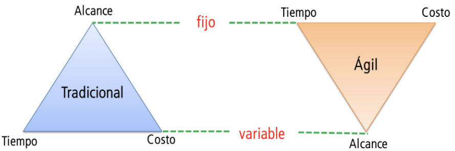
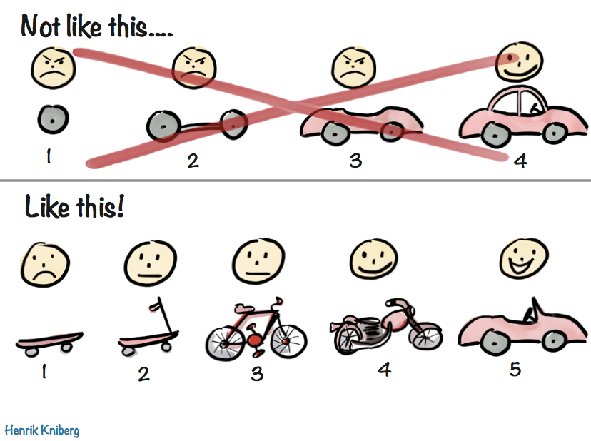
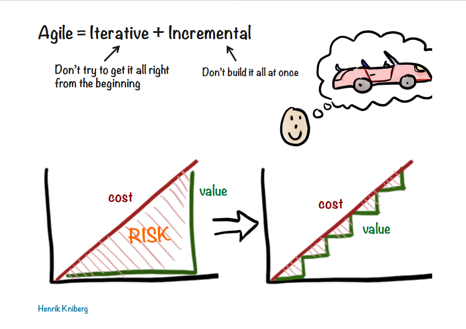
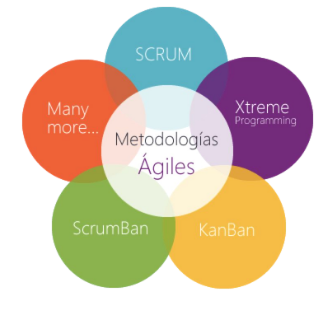
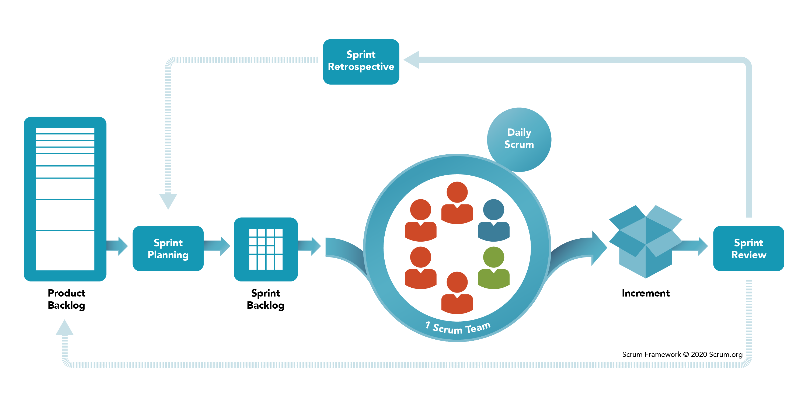
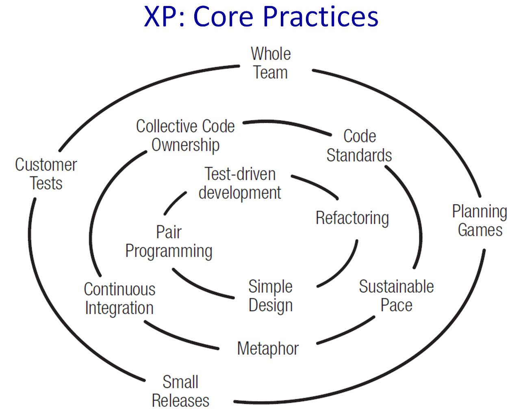

# Agile
[Planning fallacy](https://en.wikipedia.org/wiki/Planning_fallacy)

## El triángulo de hierro

## Valores del manifiesto ágil
**Individuos e interacciones** sobre procesos y herramientas

**Software funcionando** sobre documentación extensiva

**Colaboración con el cliente** sobre negociación contractual

**Respuesta ante el cambio** sobre seguir un plan

*Esto es, aunque valoramos los elementos de la derecha, valoramos más los de la izquierda.*

## Principios del manifiesto ágil
Elijo algunos de los 12 principios:

6. El método más eficiente y efectivo de comunicar información entre el equipos y sus miembros es la **comunicación cara a cara** (mayor Ancho de Banda).
8. Los procesos Ágiles promueven el **desarrollo sostenible** -> mantener un **ritmo constante de forma indefinida**.
10. Es esencial la simplicidad -> el arte de **maximizar la cantidad de trabajo no realizado**.
12. El equipo **reflexiona a intervalos regulares** para **cambiar su comportamiento en base a lo aprendido**.

## Prácticas y metodologías ágiles
### Maximizar el valor
- Planificación en términos de producto
- Priorización en base a valor
- Colaboración con el cliente
- Visibilidad del proceso
- Detectar y eliminar desperdicio

### Desarrollo iterativo e incremental

### Agile != Scrum
1. 4 people in the room (Cockburn)
2. Extreme Programming
3. Kanban
4. Crystal
5. Scrum

# Scrum

## Panel de scrum (artefacto)
| To-Do  | Doing | Done |
| ------ | ----- | ---- |
|        |       |      |

# XP
> "El problema básico del desarrollo de software es el riesgo."
> – Kent Beck

- Evitar riesgos de software
- Acortar el ciclo de feedback:
	- Con compañeros (programando)
	- Con clientes (features)
	- Con usuarios (a producción)

## ¿Para qué XP?
- ~~Calidad~~
- ~~Código limpio~~
- ~~Profesionalidad~~
- ~~Hacer lo correcto~~

- Economics
- Felicidad
