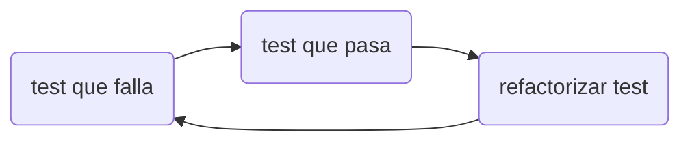

# Testing
Un test es un bloque de código que ejecuta a otro código (SUT[^1]) para validar de forma automática su correcto funcionamiento.

[^1]: System Under Test

## Tipos de tests
- Unitarios
- Integración
- Aceptación o extremo a extremo (end to end, E2E)
- Regresión visual

## Estructura de un test
```
- Preparación / Ejecución / Aserción
- Arrange     / Act       / Assert   (AAA)
```

Ejemplo de test escrito con [Jest](https://en.wikipedia.org/wiki/Jest_(JavaScript_framework)):
```javascript
describe(name: 'Sum', fun: () => {
//^^^ conjunto de tests

/*
LEGIBILIDAD DE LOS TESTS: más importante en los tests incluso que en código de producción.
- Claridad, simplicidad y densidad. Eliminar detalles innecesarios.
- Utilizar el lenguaje de dominio para describirlos
*/

	it('should sum two numbers', () => {

		// Arrange:
		const num1 = 1;
		const num2 = 2;

		// Act:
		const result = sum(num1, num2);

		// Assert:
		expect(result).toEqual(3);

	})

})
```

## Cualidades de un test
**FIRST**:
- **F**ast
- **I**ndependent
- **R**epeteable
- **S**elf-validating
- **T**imely (oportuno: los programamos lo antes posible)

## Puntos clave
- En cada test prueba UNA sola cosa que funciona.
- Testea el qué, no el cómo.
- Testea la interfaz pública de cada unidad, no los métodos privados (la interfaz pública solo llamará a los privados).
- Hay que mantener los tests, deben ser fáciles de entender, y sólo deben fallar cuando aquello que quieres probar no funciona.
- No testees código trivial, que no tiene lógica (p.ej. getters,
setters).
- Elimina detalles innecesarios (incluso tests que se hayan convertido en innecesarios, una vez han cumplido su labor de ayudarte en el proceso de desarrollo).
- No escribas tests por buscar el 100% de cobertura. Haz test útiles que te ayuden a comprobar que el sistema funciona y te den fiabilidad a la hora de refactorizar.

# TDD
Es una técnica de desarrollo de software que consiste en escribir tests antes de escribir el código.

TDD:
- No te guía a hacer un buen diseño.
- No es dogma.
- No es una técnica de testing.

## Beneficios TDD
- Obliga a pensar en el comportamiento antes de programar.
- Da feedback rápido.
- Reduce el miedo a cambiar el código. Los tests actúan como red de seguridad.
- Guía la documentación. Usamos los tests como documentación viva.

## Las tres leyes de TDD
1. No está permitido escribir código de producción sin tener antes **un test unitario que falle**.
2. No está permitido escribir más código de test que el mínimo para hacer que el test falle.
3. No está permitido escribir más código de producción que el suficiente para que el test que fallaba ahora pase.

## Ciclo de TDD: rojo-verde-refactor


---
> "TDD es un poco *ir a romper tu código*, porque así ves dónde lo puedes mejorar."
> – Stefan
---
La idea de TDD es ir desarrollando **a un ritmo constante, sostenible y controlado**.
