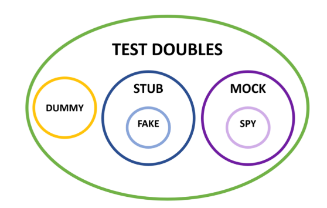

# Test doubles
Como los dobles del cine de acción.

También se conocen como "mocks", aunque estos son un tipo concreto de doble (["mocks aren't stubs"](https://martinfowler.com/articles/mocksArentStubs.html)).

## Tipos de dobles
En el *Arrange* ("dobles de estado"):
- **Dummy**: objeto que se pasa para cumplir una dependencia. No son comunes en sistemas bien diseñados.
- **Stub**: reemplaza la respuesta de una llamada a API/BBDD. Siempre devuelve datos.
- **Fake**: es un stub hecho a mano, además implementando cierta lógica. Ej.: BBDD en memoria, enrutador con con ciertas rutas predefinidas.

En el *Assert* ("dobles de interacción", más frágiles):
- **Mock**: valida que un comportamiento deseado se ha cumplido. Ej.: "Espero que el método X se haya llamado. Si no, lanzo error".
- **Spy**: comprueba que algo ha ocurrido. Hasta que no le preguntas no habla (no falla).

No hay que usar dobles de tests para objetos/métodos simples.
