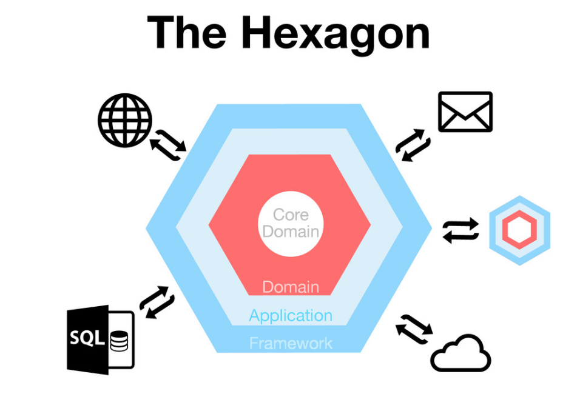

# Arquitectura Hexagonal
La arquitectura de software se refiere al conjunto de reglas que decidimos como equipo al definir cómo diseñamos nuestro software.

> - the set of design decisions that must be made early
> - the decisions that you wish you could get right eary
> - the decisions that are hard to change
> – Martin Fowler, ["Making Architecture Matter"](https://youtu.be/DngAZyWMGR0)

## Design Payoff Line
[](https://martinfowler.com/bliki/DesignStaminaHypothesis.html)

### Complejidad esencial vs. Complejidad accidental

## Tipos de arquitecturas
- Old School ("a batalla", sin arquitectura)
- MVC
- Arquitecturas limpias (arquitectura hexagonal)

## Arquitecturas limpias

[](https://blog.cleancoder.com/uncle-bob/2012/08/13/the-clean-architecture.html)

#### Regla de dependencia
Las caps de fuera conocen lo que hay inmediatamente dentro, pero las capas de dentro no saben nada sobre lo que hay fuera.

## Arquitectura hexagonal
[](https://fideloper.com/hexagonal-architecture)

### Capa de dominio
A la que pertenece lo relacionado con el problema específico del mundo real que tratamos de resolver desarrollando software

**Entidad**: Objeto del modelo con identidad propia, distinguible de otros objetos con los mismos atributos (ej.: usuarios).

**Value Object**: Clase que se identifica por el valor que representa, no por su identidad (ej.: números, fechas, monedas, URLs). Por ejemplo, podrían ser value objects para nosotros dos productos que cuesten 5€, por ser idénticos en cuanto a precio.

### Capa de aplicación
Engloba los "casos de uso" o "servicios de aplicación" que representan de forma atómica las funcionalidades del sistema.

Los casos de uso pueden hacer de "barrera transaccional" (o suceden o no suceden, no se quedan a medias) con el sistema de persistencia.

### Capa de infraestructura
Es código que cambia en función de decisiones externas (ej.: librerías).

- [ ] #to-do: Principio de Inversión de Dependencias
- [ ] #to-do: Patrón de diseño de Inyección de Dependencias  

---
ej.: abstracción: `$Invoice`**`Repository`**
> Queremos conseguir **que los Casos de uso dependan de algo abstracto**

ej.: que no dependa de qué base de datos usamos, sino que directamente tengamos un `invoiceRepository.save(invoice)`

---
¿Por qué hacer una abstracción cuando solo tienes una implementación?
Porque el coste a futuro de cambiar eso es mucho más caro si no hacemos la abstracción de primeras.

---

```
src/
├── core/
│   ├── domain/
│   ├── infrastructure/
│   └── services/
└── ui/    # ui/ es infraestructura, pero la sacan fuera por ser
	|      # muy grande e incluso desacoplada en cuanto a lenguaje
    ├── components/
    ├── theme/
    └── views/
```